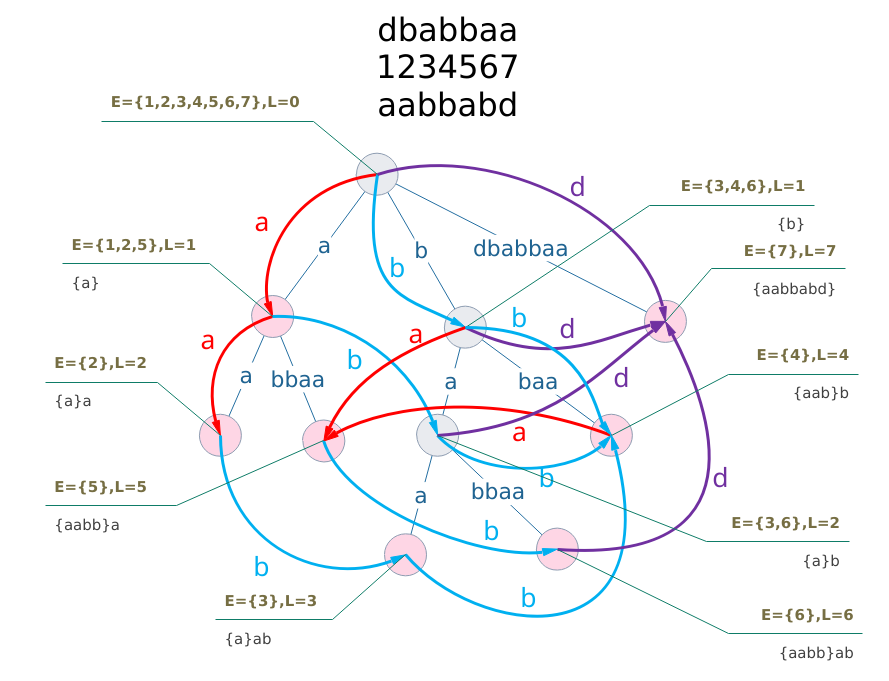

# 字符串

## 后缀自动机



+ 广义后缀自动机如果直接使用以下代码的话会产生一些冗余状态（置 last 为 1），所以要用拓扑排序。用 len 基数排序不能。
+ 字符集大的话要使用`map`。
+ 树上 dp 时注意边界（root 和 null）。
+ rsort 中的数组 a 是拓扑序 [1, sz)

```cpp
namespace sam {
    const int M = N << 1;
    int t[M][26], len[M] = {-1}, fa[M], sz = 2, last = 1;
    void init() { memset(t, 0, (sz + 10) * sizeof t[0]); sz = 2; last = 1; }
    void ins(int ch) {
        int p = last, np = last = sz++;
        len[np] = len[p] + 1;
        for (; p && !t[p][ch]; p = fa[p]) t[p][ch] = np;
        if (!p) { fa[np] = 1; return; }
        int q = t[p][ch];
        if (len[p] + 1 == len[q]) fa[np] = q;
        else {
            int nq = sz++; len[nq] = len[p] + 1;
            memcpy(t[nq], t[q], sizeof t[0]);
            fa[nq] = fa[q];
            fa[np] = fa[q] = nq;
            for (; t[p][ch] == q; p = fa[p]) t[p][ch] = nq;
        }
    }

    int c[M] = {1}, a[M];
    void rsort() {
        FOR (i, 1, sz) c[i] = 0;
        FOR (i, 1, sz) c[len[i]]++;
        FOR (i, 1, sz) c[i] += c[i - 1];
        FOR (i, 1, sz) a[--c[len[i]]] = i;
    }
}
```

+ 真·广义后缀自动机

```cpp
int t[M][26], len[M] = {-1}, fa[M], sz = 2, last = 1;
LL cnt[M][2];
void ins(int ch, int id) {
    int p = last, np = 0, nq = 0, q = -1;
    if (!t[p][ch]) {
        np = sz++;
        len[np] = len[p] + 1;
        for (; p && !t[p][ch]; p = fa[p]) t[p][ch] = np;
    }
    if (!p) fa[np] = 1;
    else {
        q = t[p][ch];
        if (len[p] + 1 == len[q]) fa[np] = q;
        else {
            nq = sz++; len[nq] = len[p] + 1;
            memcpy(t[nq], t[q], sizeof t[0]);
            fa[nq] = fa[q];
            fa[np] = fa[q] = nq;
            for (; t[p][ch] == q; p = fa[p]) t[p][ch] = nq;
        }
    }
    last = np ? np : nq ? nq : q;
    cnt[last][id] = 1;
}
```


+ 按字典序建立后缀树 注意逆序插入
+ rsort2 里的 a 不是拓扑序，需要拓扑序就去树上做

```cpp
void ins(int ch, int pp) {
    int p = last, np = last = sz++;
    len[np] = len[p] + 1; one[np] = pos[np] = pp;
    for (; p && !t[p][ch]; p = fa[p]) t[p][ch] = np;
    if (!p) { fa[np] = 1; return; }
    int q = t[p][ch];
    if (len[q] == len[p] + 1) fa[np] = q;
    else {
        int nq = sz++; len[nq] = len[p] + 1; one[nq] = one[q];
        memcpy(t[nq], t[q], sizeof t[0]);
        fa[nq] = fa[q];
        fa[q] = fa[np] = nq;
        for (; p && t[p][ch] == q; p = fa[p]) t[p][ch] = nq;
    }
}

int up[M], c[256] = {2}, a[M];
void rsort2() {
    FOR (i, 1, 256) c[i] = 0;
    FOR (i, 2, sz) up[i] = s[one[i] + len[fa[i]]];
    FOR (i, 2, sz) c[up[i]]++;
    FOR (i, 1, 256) c[i] += c[i - 1];
    FOR (i, 2, sz) a[--c[up[i]]] = i;
    FOR (i, 2, sz) G[fa[a[i]]].push_back(a[i]);
}
```

+ 广义后缀自动机建后缀树，必须反向插入

```cpp
int t[M][26], len[M] = {0}, fa[M], sz = 2, last = 1;
char* one[M];
void ins(int ch, char* pp) {
    int p = last, np = 0, nq = 0, q = -1;
    if (!t[p][ch]) {
        np = sz++; one[np] = pp;
        len[np] = len[p] + 1;
        for (; p && !t[p][ch]; p = fa[p]) t[p][ch] = np;
    }
    if (!p) fa[np] = 1;
    else {
        q = t[p][ch];
        if (len[p] + 1 == len[q]) fa[np] = q;
        else {
            nq = sz++; len[nq] = len[p] + 1; one[nq] = one[q];
            memcpy(t[nq], t[q], sizeof t[0]);
            fa[nq] = fa[q];
            fa[np] = fa[q] = nq;
            for (; t[p][ch] == q; p = fa[p]) t[p][ch] = nq;
        }
    }
    last = np ? np : nq ? nq : q;
}
int up[M], c[256] = {2}, aa[M];
vector<int> G[M];
void rsort() {
    FOR (i, 1, 256) c[i] = 0;
    FOR (i, 2, sz) up[i] = *(one[i] + len[fa[i]]);
    FOR (i, 2, sz) c[up[i]]++;
    FOR (i, 1, 256) c[i] += c[i - 1];
    FOR (i, 2, sz) aa[--c[up[i]]] = i;
    FOR (i, 2, sz) G[fa[aa[i]]].push_back(aa[i]);
}
```

+ 匹配

```cpp
int u = 1, l = 0;
FOR (i, 0, strlen(s)) {
    int ch = s[i] - 'a';
    while (u && !t[u][ch]) { u = fa[u]; l = len[u]; }
    ++l; u = t[u][ch];
    if (!u) u = 1;
    if (l) // do something...
}
```

+ 获取子串状态
```cpp
int get_state(int l, int r) {
    int u = rpos[r], s = r - l + 1;
    FORD (i, SP - 1, -1) if (len[pa[u][i]] >= s) u = pa[u][i];
    return u;
}
```

+ 配合 LCT

```cpp
namespace lct_sam {
    extern struct P *const null;
    const int M = N;
    struct P {
        P *fa, *ls, *rs;
        int last;

        bool has_fa() { return fa->ls == this || fa->rs == this; }
        bool d() { return fa->ls == this; }
        P*& c(bool x) { return x ? ls : rs; }
        P* up() { return this; }
        void down() {
            if (ls != null) ls->last = last;
            if (rs != null) rs->last = last;
        }
        void all_down() { if (has_fa()) fa->all_down(); down(); }
    } *const null = new P{0, 0, 0, 0}, pool[M], *pit = pool;
    P* G[N];
    int t[M][26], len[M] = {-1}, fa[M], sz = 2, last = 1;

    void rot(P* o) {
        bool dd = o->d();
        P *f = o->fa, *t = o->c(!dd);
        if (f->has_fa()) f->fa->c(f->d()) = o; o->fa = f->fa;
        if (t != null) t->fa = f; f->c(dd) = t;
        o->c(!dd) = f->up(); f->fa = o;
    }
    void splay(P* o) {
        o->all_down();
        while (o->has_fa()) {
            if (o->fa->has_fa())
                rot(o->d() ^ o->fa->d() ? o : o->fa);
            rot(o);
        }
        o->up();
    }
    void access(int last, P* u, P* v = null) {
        if (u == null) { v->last = last; return; }
        splay(u);
        P *t = u;
        while (t->ls != null) t = t->ls;
        int L = len[fa[t - pool]] + 1, R = len[u - pool];
        
        if (u->last) bit::add(u->last - R + 2, u->last - L + 2, 1);
        else bit::add(1, 1, R - L + 1);
        bit::add(last - R + 2, last - L + 2, -1);
        
        u->rs = v;
        access(last, u->up()->fa, u);
    }
    void insert(P* u, P* v, P* t) {
        if (v != null) { splay(v); v->rs = null; }
        splay(u);
        u->fa = t; t->fa = v;
    }

    void ins(int ch, int pp) {
        int p = last, np = last = sz++;
        len[np] = len[p] + 1;
        for (; p && !t[p][ch]; p = fa[p]) t[p][ch] = np;
        if (!p) fa[np] = 1;
        else {
            int q = t[p][ch];
            if (len[p] + 1 == len[q]) { fa[np] = q; G[np]->fa = G[q]; }
            else {
                int nq = sz++; len[nq] = len[p] + 1;
                memcpy(t[nq], t[q], sizeof t[0]);
                insert(G[q], G[fa[q]], G[nq]);
                G[nq]->last = G[q]->last;
                fa[nq] = fa[q];
                fa[np] = fa[q] = nq;
                G[np]->fa = G[nq];
                for (; t[p][ch] == q; p = fa[p]) t[p][ch] = nq;
            }
        }
        access(pp + 1, G[np]);
    }

    void init() {
        ++pit;
        FOR (i, 1, N) {
            G[i] = pit++;
            G[i]->ls = G[i]->rs = G[i]->fa = null;
        }
        G[1] = null;
    }
}
```

## 回文自动机

+ num 是该结点表示的前缀的回文后缀个数
+ cnt 是该结点表示的回文串在原串中的出现次数（使用前需要向父亲更新）

```cpp
namespace pam {
    int t[N][26], fa[N], len[N], rs[N], cnt[N], num[N];
    int sz, n, last;
    int _new(int l) {
        memset(t[sz], 0, sizeof t[0]);
        len[sz] = l; cnt[sz] = num[sz] = 0;
        return sz++;
    }
    void init() {
        rs[n = sz = 0] = -1;
        last = _new(0);
        fa[last] = _new(-1);
    }
    int get_fa(int x) {
        while (rs[n - 1 - len[x]] != rs[n]) x = fa[x];
        return x;
    }
    void ins(int ch) {
        rs[++n] = ch;
        int p = get_fa(last);
        if (!t[p][ch]) {
            int np = _new(len[p] + 2);
            num[np] = num[fa[np] = t[get_fa(fa[p])][ch]] + 1;
            t[p][ch] = np;
        }
        ++cnt[last = t[p][ch]];
    }
}
```

## manacher

```cpp
int RL[N];
void manacher(int* a, int n) { // "abc" => "#a#b#a#"
    int r = 0, p = 0;
    FOR (i, 0, n) {
        if (i < r) RL[i] = min(RL[2 * p - i], r - i);
        else RL[i] = 1;
        while (i - RL[i] >= 0 && i + RL[i] < n && a[i - RL[i]] == a[i + RL[i]])
            RL[i]++;
        if (RL[i] + i - 1 > r) { r = RL[i] + i - 1; p = i; }
    }
    FOR (i, 0, n) --RL[i];
}

```

## 哈希

内置了自动双哈希开关（小心 TLE）。

```cpp
#include <bits/stdc++.h>
using namespace std;

#define ENABLE_DOUBLE_HASH

typedef long long LL;
typedef unsigned long long ULL;

const int x = 135;
const int N = 4e5 + 10;
const int p1 = 1e9 + 7, p2 = 1e9 + 9;
ULL xp1[N], xp2[N], xp[N];

void init_xp() {
    xp1[0] = xp2[0] = xp[0] = 1;
    for (int i = 1; i < N; ++i) {
        xp1[i] = xp1[i - 1] * x % p1;
        xp2[i] = xp2[i - 1] * x % p2;
        xp[i] = xp[i - 1] * x;
    }
}

struct String {
    char s[N];
    int length, subsize;
    bool sorted;
    ULL h[N], hl[N];

    ULL hash() {
        length = strlen(s);
        ULL res1 = 0, res2 = 0;
        h[length] = 0;  // ATTENTION!
        for (int j = length - 1; j >= 0; --j) {
        #ifdef ENABLE_DOUBLE_HASH
            res1 = (res1 * x + s[j]) % p1;
            res2 = (res2 * x + s[j]) % p2;
            h[j] = (res1 << 32) | res2;
        #else
            res1 = res1 * x + s[j];
            h[j] = res1;
        #endif
            // printf("%llu\n", h[j]);
        }
        return h[0];
    }

    // 获取子串哈希，左闭右开区间
    ULL get_substring_hash(int left, int right) const {
        int len = right - left;
    #ifdef ENABLE_DOUBLE_HASH
        // get hash of s[left...right-1]
        unsigned int mask32 = ~(0u);
        ULL left1 = h[left] >> 32, right1 = h[right] >> 32;
        ULL left2 = h[left] & mask32, right2 = h[right] & mask32;
        return (((left1 - right1 * xp1[len] % p1 + p1) % p1) << 32) |
               (((left2 - right2 * xp2[len] % p2 + p2) % p2));
    #else
        return h[left] - h[right] * xp[len];
    #endif
    }

    void get_all_subs_hash(int sublen) {
        subsize = length - sublen + 1;
        for (int i = 0; i < subsize; ++i)
            hl[i] = get_substring_hash(i, i + sublen);
        sorted = 0;
    }

    void sort_substring_hash() {
        sort(hl, hl + subsize);
        sorted = 1;
    }

    bool match(ULL key) const {
        if (!sorted) assert (0);
        if (!subsize) return false;
        return binary_search(hl, hl + subsize, key);
    }

    void init(const char *t) {
        length = strlen(t);
        strcpy(s, t);
    }
};

int LCP(const String &a, const String &b, int ai, int bi) {
    // Find LCP of a[ai...] and b[bi...]
    int l = 0, r = min(a.length - ai, b.length - bi);
    while (l < r) {
        int mid = (l + r + 1) / 2;
        if (a.get_substring_hash(ai, ai + mid) == b.get_substring_hash(bi, bi + mid))
            l = mid;
        else r = mid - 1;
    }
    return l;
}

int check(int ans) {
    if (T.length < ans) return 1;
    T.get_all_subs_hash(ans); T.sort_substring_hash();
    for (int i = 0; i < S.length - ans + 1; ++i)
        if (!T.match(S.get_substring_hash(i, i + ans)))
            return 1;
    return 0;
}

int main() {
    init_xp();  // DON'T FORGET TO DO THIS!

    for (int tt = 1; tt <= kases; ++tt) {
        scanf("%d", &n); scanf("%s", str);
        S.init(str);
        S.hash(); T.hash();
    }
}
```

二维哈希

```cpp
struct Hash2D { // 1-index
    static const LL px = 131, py = 233, MOD = 998244353;
    static LL pwx[N], pwy[N];
    int a[N][N];
    LL hv[N][N];
    static void init_xp() {
        pwx[0] = pwy[0] = 1;
        FOR (i, 1, N) {
            pwx[i] = pwx[i - 1] * px % MOD;
            pwy[i] = pwy[i - 1] * py % MOD;
        }
    }
    void init_hash(int n, int m) {
        FOR (i, 1, n + 1) {
            LL s = 0;
            FOR (j, 1, m + 1) {
                s = (s * py + a[i][j]) % MOD;
                hv[i][j] = (hv[i - 1][j] * px + s) % MOD;
            }
        }
    }
    LL h(int x, int y, int dx, int dy) {
        --x; --y;
        LL ret = hv[x + dx][y + dy] + hv[x][y] * pwx[dx] % MOD * pwy[dy]
                 - hv[x][y + dy] * pwx[dx] - hv[x + dx][y] * pwy[dy];
        return (ret % MOD + MOD) % MOD;
    }
} ha, hb;
LL Hash2D::pwx[N], Hash2D::pwy[N];
```

## 后缀数组

构造时间：$O(L \log L)$；查询时间 $O(\log L)$。`suffix` 数组是排好序的后缀下标， `suffix` 的反数组是后缀数组。

```cpp
#include <bits/stdc++.h>
using namespace std;

const int N = 2e5 + 10;
const int Nlog = 18;

struct SuffixArray {
    const int L;
    vector<vector<int> > P;
    vector<pair<pair<int, int>, int> > M;
    int s[N], sa[N], rank[N], height[N];
    // s: raw string
    // sa[i]=k: s[k...L-1] ranks i (0 based)
    // rank[i]=k: the rank of s[i...L-1] is k (0 based)
    // height[i] = lcp(sa[i-1], sa[i])

    SuffixArray(const string &raw_s) : L(raw_s.length()), P(1, vector<int>(L, 0)), M(L) {
        for (int i = 0; i < L; i++)
            P[0][i] = this->s[i] = int(raw_s[i]);
        for (int skip = 1, level = 1; skip < L; skip *= 2, level++) {
            P.push_back(vector<int>(L, 0));
            for (int i = 0; i < L; i++)
                M[i] = make_pair(make_pair(P[level - 1][i], i + skip < L ? P[level - 1][i + skip] : -1000), i);
            sort(M.begin(), M.end());
            for (int i = 0; i < L; i++)
                P[level][M[i].second] = (i > 0 && M[i].first == M[i - 1].first) ? P[level][M[i - 1].second] : i;
        }
        for (unsigned i = 0; i < P.back().size(); ++i) {
            rank[i] = P.back()[i];
            sa[rank[i]] = i;
        }
    }

    // This is a traditional way to calculate LCP
    void getHeight() {
        memset(height, 0, sizeof height);
        int k = 0;
        for (int i = 0; i < L; ++i) {
            if (rank[i] == 0) continue;
            if (k) k--;
            int j = sa[rank[i] - 1];
            while (i + k < L && j + k < L && s[i + k] == s[j + k]) ++k;
            height[rank[i]] = k;
        }
        rmq_init(height, L);
    }

    int f[N][Nlog];
    inline int highbit(int x) {
        return 31 - __builtin_clz(x);
    }

    int rmq_query(int x, int y) {
        int p = highbit(y - x + 1);
        return min(f[x][p], f[y - (1 << p) + 1][p]);
    }

    // arr has to be 0 based
    void rmq_init(int *arr, int length) {
        for (int x = 0; x <= highbit(length); ++x)
            for (int i = 0; i <= length - (1 << x); ++i) {
                if (!x) f[i][x] = arr[i];
                else f[i][x] = min(f[i][x - 1], f[i + (1 << (x - 1))][x - 1]);
            }
    }

    #ifdef NEW
    // returns the length of the longest common prefix of s[i...L-1] and s[j...L-1]
    int LongestCommonPrefix(int i, int j) {
        int len = 0;
        if (i == j) return L - i;
        for (int k = (int) P.size() - 1; k >= 0 && i < L && j < L; k--) {
            if (P[k][i] == P[k][j]) {
                i += 1 << k;
                j += 1 << k;
                len += 1 << k;
            }
        }
        return len;
    }
    #else
    int LongestCommonPrefix(int i, int j) {
        // getHeight() must be called first
        if (i == j) return L - i;
        if (i > j) swap(i, j);
        return rmq_query(i + 1, j);
    }
    #endif

    int checkNonOverlappingSubstring(int K) {
        // check if there is two non-overlapping identical substring of length K
        int minsa = 0, maxsa = 0;
        for (int i = 0; i < L; ++i) {
            if (height[i] < K) {
                minsa = sa[i]; maxsa = sa[i];
            } else {
                minsa = min(minsa, sa[i]);
                maxsa = max(maxsa, sa[i]);
                if (maxsa - minsa >= K) return 1;
            }
        }
        return 0;
    }

    int checkBelongToDifferentSubstring(int K, int split) {
        int minsa = 0, maxsa = 0;
        for (int i = 0; i < L; ++i) {
            if (height[i] < K) {
                minsa = sa[i]; maxsa = sa[i];
            } else {
                minsa = min(minsa, sa[i]);
                maxsa = max(maxsa, sa[i]);
                if (maxsa > split && minsa < split) return 1;
            }
        }
        return 0;
    }

} *S;

int main() {
    string s, t;
    cin >> s >> t;
    int sp = s.length();
    s += "*" + t;
    S = new SuffixArray(s);
    S->getHeight();
    int left = 0, right = sp;
    while (left < right) {
        int mid = (left + right + 1) / 2;
        if (S->checkBelongToDifferentSubstring(mid, sp))
            left = mid;
        else right = mid - 1;
    }
    printf("%d\n", left);
}
```

+ SA-IS
+ 仅在后缀自动机被卡内存或者卡常且需要 O(1) LCA 的情况下使用（比赛中敲这个我觉得不行）
+ UOJ 35

```cpp
// rk [0..n-1] -> [1..n], sa/ht [1..n]
// s[i] > 0 && s[n] = 0
// b: normally as bucket
// c: normally as bucket1
// d: normally as bucket2
// f: normally as cntbuf

template<size_t size>
struct SuffixArray {
    bool t[size << 1];
    int b[size], c[size];
    int sa[size], rk[size], ht[size];
    inline bool isLMS(const int i, const bool *t) { return i > 0 && t[i] && !t[i - 1]; }
    template<class T>
    inline void inducedSort(T s, int *sa, const int n, const int M, const int bs,
                            bool *t, int *b, int *f, int *p) {
        fill(b, b + M, 0); fill(sa, sa + n, -1);
        FOR (i, 0, n) b[s[i]]++;
        f[0] = b[0];
        FOR (i, 1, M) f[i] = f[i - 1] + b[i];
        FORD (i, bs - 1, -1) sa[--f[s[p[i]]]] = p[i];
        FOR (i, 1, M) f[i] = f[i - 1] + b[i - 1];
        FOR (i, 0, n) if (sa[i] > 0 && !t[sa[i] - 1]) sa[f[s[sa[i] - 1]]++] = sa[i] - 1;
        f[0] = b[0];
        FOR (i, 1, M) f[i] = f[i - 1] + b[i];
        FORD (i, n - 1, -1) if (sa[i] > 0 && t[sa[i] - 1]) sa[--f[s[sa[i] - 1]]] = sa[i] - 1;
    }
    template<class T>
    inline void sais(T s, int *sa, int n, bool *t, int *b, int *c, int M) {
        int i, j, bs = 0, cnt = 0, p = -1, x, *r = b + M;
        t[n - 1] = 1;
        FORD (i, n - 2, -1) t[i] = s[i] < s[i + 1] || (s[i] == s[i + 1] && t[i + 1]);
        FOR (i, 1, n) if (t[i] && !t[i - 1]) c[bs++] = i;
        inducedSort(s, sa, n, M, bs, t, b, r, c);
        for (i = bs = 0; i < n; i++) if (isLMS(sa[i], t)) sa[bs++] = sa[i];
        FOR (i, bs, n) sa[i] = -1;
        FOR (i, 0, bs) {
            x = sa[i];
            for (j = 0; j < n; j++) {
                if (p == -1 || s[x + j] != s[p + j] || t[x + j] != t[p + j]) { cnt++, p = x; break; }
                else if (j > 0 && (isLMS(x + j, t) || isLMS(p + j, t))) break;
            }
            x = (~x & 1 ? x >> 1 : x - 1 >> 1), sa[bs + x] = cnt - 1;
        }
        for (i = j = n - 1; i >= bs; i--) if (sa[i] >= 0) sa[j--] = sa[i];
        int *s1 = sa + n - bs, *d = c + bs;
        if (cnt < bs) sais(s1, sa, bs, t + n, b, c + bs, cnt);
        else FOR (i, 0, bs) sa[s1[i]] = i;
        FOR (i, 0, bs) d[i] = c[sa[i]];
        inducedSort(s, sa, n, M, bs, t, b, r, d);
    }
    template<typename T>
    inline void getHeight(T s, const int n, const int *sa) {
        for (int i = 0, k = 0; i < n; i++) {
            if (rk[i] == 0) k = 0;
            else {
                if (k > 0) k--;
                int j = sa[rk[i] - 1];
                while (i + k < n && j + k < n && s[i + k] == s[j + k]) k++;
            }
            ht[rk[i]] = k;
        }
    }
    template<class T>
    inline void init(T s, int n, int M) {
        sais(s, sa, ++n, t, b, c, M);
        for (int i = 1; i < n; i++) rk[sa[i]] = i;
        getHeight(s, n, sa);
    }
};

const int N = 2E5 + 100;
SuffixArray<N> sa;

int main() {
    string s; cin >> s; int n = s.length();
    sa.init(s, n, 128);
    FOR (i, 1, n + 1) printf("%d%c", sa.sa[i] + 1, i == _i - 1 ? '\n' : ' ');
    FOR (i, 2, n + 1) printf("%d%c", sa.ht[i], i == _i - 1 ? '\n' : ' ');
}
```

## KMP

+ 前缀函数（每一个前缀的最长 border）

```cpp
void get_pi(int a[], char s[], int n) {
    int j = a[0] = 0;
    FOR (i, 1, n) {
        while (j && s[i] != s[j]) j = a[j - 1];
        a[i] = j += s[i] == s[j];
    }
}
```

+ Z 函数（每一个后缀和该字符串的 LCP 长度）

```cpp
void get_z(int a[], char s[], int n) {
    int l = 0, r = 0; a[0] = n;
    FOR (i, 1, n) {
        a[i] = i > r ? 0 : min(r - i + 1, a[i - l]);
        while (i + a[i] < n && s[a[i]] == s[i + a[i]]) ++a[i];
        if (i + a[i] - 1 > r) { l = i; r = i + a[i] - 1; }
    }
}
```


## Trie

```cpp
namespace trie {
    int t[N][26], sz, ed[N];
    void init() { sz = 2; memset(ed, 0, sizeof ed); }
    int _new() { memset(t[sz], 0, sizeof t[sz]); return sz++; }
    void ins(char* s, int p) {
        int u = 1;
        FOR (i, 0, strlen(s)) {
            int c = s[i] - 'a';
            if (!t[u][c]) t[u][c] = _new();
            u = t[u][c];
        }
        ed[u] = p;
    }
}
```

## AC 自动机

```cpp
const int N = 1e6 + 100, M = 26;

int mp(char ch) { return ch - 'a'; }

struct ACA {
    int ch[N][M], danger[N], fail[N];
    int sz;
    void init() {
        sz = 1;
        memset(ch[0], 0, sizeof ch[0]);
        memset(danger, 0, sizeof danger);
    }
    void insert(const string &s, int m) {
        int n = s.size(); int u = 0, c;
        FOR (i, 0, n) {
            c = mp(s[i]);
            if (!ch[u][c]) {
                memset(ch[sz], 0, sizeof ch[sz]);
                danger[sz] = 0; ch[u][c] = sz++;
            }
            u = ch[u][c];
        }
        danger[u] |= 1 << m;
    }
    void build() {
        queue<int> Q;
        fail[0] = 0;
        for (int c = 0, u; c < M; c++) {
            u = ch[0][c];
            if (u) { Q.push(u); fail[u] = 0; }
        }
        while (!Q.empty()) {
            int r = Q.front(); Q.pop();
            danger[r] |= danger[fail[r]];
            for (int c = 0, u; c < M; c++) {
                u = ch[r][c];
                if (!u) {
                    ch[r][c] = ch[fail[r]][c];
                    continue;
                }
                fail[u] = ch[fail[r]][c];
                Q.push(u);
            }
        }
    }
} ac;

char s[N];

int main() {
    int n; scanf("%d", &n);
    ac.init();
    while (n--) {
        scanf("%s", s);
        ac.insert(s, 0);
    }
    ac.build();

    scanf("%s", s);
    int u = 0; n = strlen(s);
    FOR (i, 0, n) {
        u = ac.ch[u][mp(s[i])];
        if (ac.danger[u]) {
            puts("YES");
            return 0;
        }
    }
    puts("NO");
    return 0;
}
```

